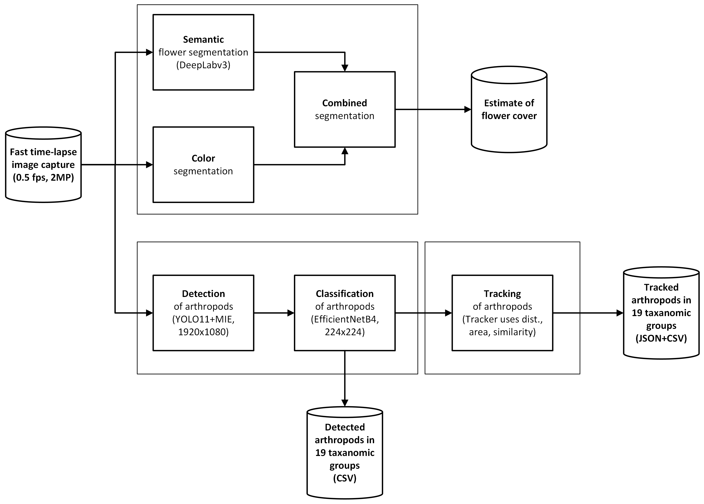

# insectsDCT
Python code to detect, classify, and track insects with a background of plants and flowers
This project contains Python code for processing time-lapse images from insect camera traps. 
(detection, classification, tracking, and floral cover estimation)

## The algorithms used are described in the papers: 

Object detection with Motion-Informed Enhancement (MIE):

"Object Detection of Small Insects in Time-Lapse Camera Recordings".   
https://www.mdpi.com/1424-8220/23/16/7242

Estimating flower cover with color and semantic segmentation and classification of 19 taxonomic groups of arthropods:

"A deep learning pipeline for time-lapse camera monitoring of floral environments and insect populations".   
https://doi.org/10.1016/j.ecoinf.2024.102861 

Tracking insects in low-framerate video recordings (<1fps):

"Towards edge processing of images from insect camera traps".   
https://www.biorxiv.org/content/10.1101/2024.07.01.601488v2

# This repository includes the essential Python code for the steps in the figure below. 

## Python environment files ##
README-conda-env-yolo11.txt - environment requirements

### Getting started ###

1. Download, unzip, and copy the python npy files to the subfolder python as described above
  
2. Install the environment requirements see: README-conda-env-yolo11.txt (Anaconda)

3. Activate the python environment

   - Anaconda: $ conda activate yolo11
  
4. Run the Python code to test and plot the abundance of arthropods

   - $ python pipeDetectAndClassifyInsects.py
   - $ python pipeTrackInsects.py

### CSV files in detections directory ###

Content of *.csv files which contain lines for each detection (piX_YYYY_MM_DD.csv):

	trap,trapId,date,time,orderConf,orderId,x1,y1,x2,y2,fileName

Where the orderId will be updated with the following classification codes:

	1 - Ladybirds   
	2 - Beetles   
	3 - Plants   
	4 - Bumblebees   
	5 - Hoverflies   
	6 - Butterflies   
	7 - Spiders   
	8 - Ants   
	9 - Flies   
	10 - True bugs   
	11 - Isopods   
	12 - Unspecified   
	13 - Hymenoptera   
	14 - Grasshoppers   
	15 - R. fulva   
	16 - Satyrines   
	17 - Small tortoiseshell   
	18 - Dragonflies   
	19 - Honeybees

Example:

	pi1,1,20250221,115753,64,19,1335,820,1386,888,pi1_2025_02_21/pi2_2025_02_21_11_57_53.jpg   
	pi1,1,20250221,115807,39,12,422,729,489,776,pi1_2025_02_21/pi2_2025_02_21_11_58_07.jpg

### CSV and JSON files in tracks directory ###

Content of *.csv files which contain lines for each track (piX_YYYY_MM_DDTR.csv):

	id,startdate,starttime,endtime,duration,class,counts,confidence,size,distance

	Where class is the same as orderId and id is the track number

Example:

	0,20250221,11:57:31,11:58:23,52.00,Hymenoptera,18,36.84,3198.74,3171   
	1,20250221,11:58:07,11:58:31,24.00,Hymenoptera,12,53.85,2686.08,1364

Content of *.csv files which contain lines for each detection in each track (piX_YYYY_MM_DDTRS.csv):

	id,date,time,percent,class,xc,yc,x1,y1,width,height,image

Example:
	0,20250221,115731,60,Hymenoptera,1331,632,1307,600,49,64,pi2_2025_02_21_11_57_31.jpg   
	0,20250221,115732,79,Hymenoptera,1310,674,1285,640,50,68,pi2_2025_02_21_11_57_32.jpg   
	0,20250221,115734,63,Background,1278,700,1252,682,52,37,pi2_2025_02_21_11_57_34.jpg

## Training and testing insect detector model (YOLO11) and classifier (EfficientNetB4) ##

### Code for inspiration to create datasets with motion (MIE) images: ###

  - createAccurateDataset.py, Create_MotionNI-dataset.py

### Subdirectories with python helper classes ###

  - common - contains Python code used by pipeDetectAndClassifyInsects.py   
  - idac - contains python code used by pipeTrackInsects.py

### Training and validating YOLO11 on color or motion (MIE) images: ###

 - insectsColorTrain.py, insectsColorVal.py   
 - insectsMotionTrain.py

## Training and validation of arthropod classifier (EfficientNetB4) ##

### Dataset for training the arthropod classifier (NI2-19cls) can be downloaded from Zenodo ###
https://zenodo.org/records/13772695
Copy the NI2-19cls.zip to datasets and unpack the file

### Training arthropod classifier with 19 taxonomic groups ###

 - training-ClassificationExtended19Cls.py - used for training SOAT CNNs including: ResNetv50, EfficientNetB4, MobileNetv2, InceptionV3, DenseNet201, ConvNeXtTiny and ConvNeXtBase

