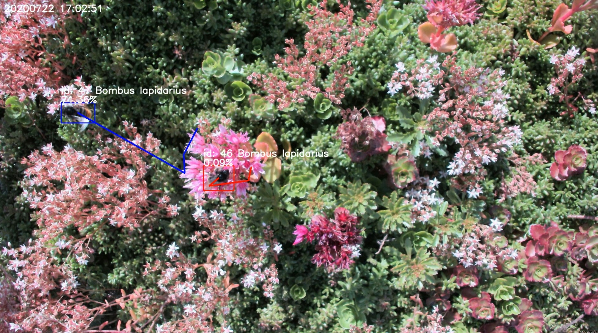
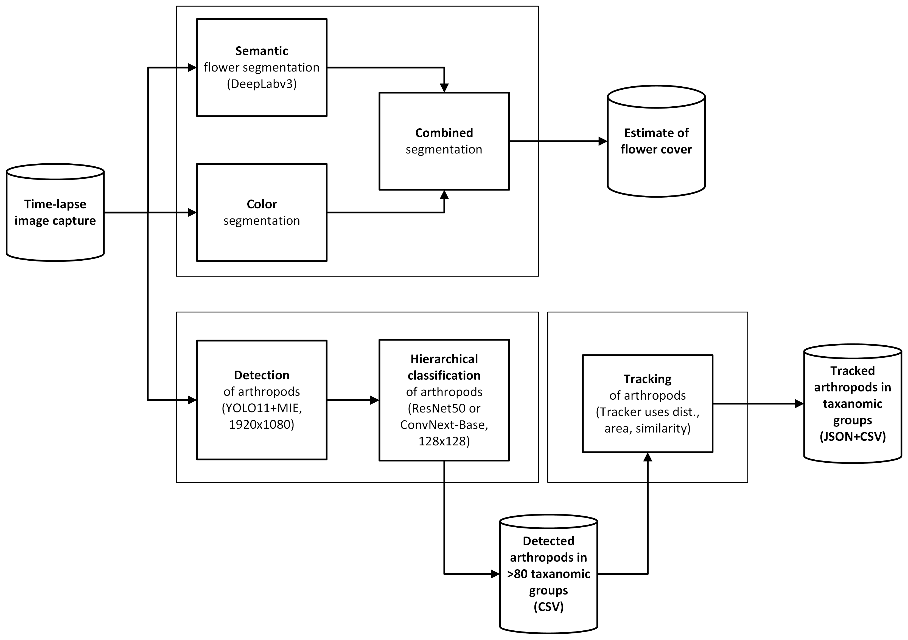
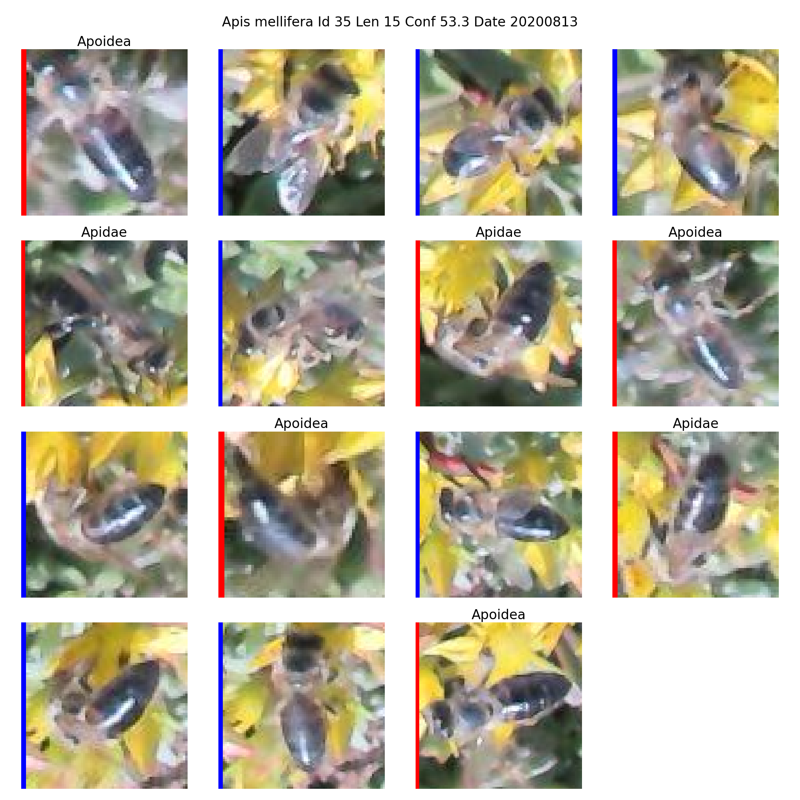
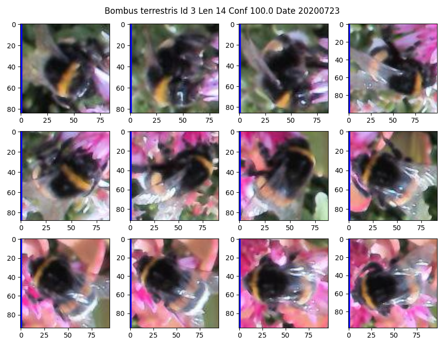

# InsectDCT

This project contains Python code for processing time-lapse recorded images from insect camera traps. 
It contains code to detect, classify, and track insects with various backgrounds of plants and flowers.
(Detection, classification, and tracking, where floral cover estimation will be added later.)

Tracking should be used for high time-lapse recordings (0.33 - 1fps); otherwise, typical time-lapse intervals are 30 - 60 seconds.
Full-sized images are resized to 1920x1080 pixels for detection with YOLO11.
Insects detected with bounding boxes are cropped with rectangular windows and resized to 128x128 (CV6) or 224x224 (CV7) pixels for classification with CNN models.

### The complete pipeline and dataset are decribed in the paper:

Kim Bjerge, Simon Wogram, Pau Enric Serra-Marin, Toke T. Høye,
"InsectDCT: A generalised pipeline for detection, taxonomic classification, and tracking of insects in camera-trap recordings", 2026, bioRxiv

### Datasets for training and testing are published at: https://zenodo.org/records/21154490

Example shown below of time-lapse tracking with two Bumblebees (<em>Bombus lapidarius</em>) visiting flowering Sedum plants. 

Video of insect tracking: https://www.youtube.com/watch?v=obxTmgERpO4

insectDCT is an AI-based pipeline for detection, hierarchical classification, and tracking of insects in natural floral environments

The insectDCT framework is a multi-stage artificial intelligence pipeline designed for automated monitoring of insects in complex natural and semi-natural floral environments. The pipeline consists of three main processing stages: detection and localization, hierarchical taxonomic classification, and spatiotemporal tracking.

In the first stage, insects are detected and localized in still images and video recordings using the You Only Look Once (YOLO11) object detection architecture. To improve detection performance under challenging environmental conditions, motion-enhanced image representations are employed. The detector is trained on a large dataset acquired using insect camera traps deployed across diverse plant species and floral habitats, capturing substantial variation in background complexity, illumination, and insect morphology.

The second stage performs hierarchical taxonomic classification of detected insects into more than 80 taxa, covering multiple taxonomic ranks including order, family, and genus/species. This hierarchical approach enables robust classification across varying levels of visual granularity and supports fine-grained ecological analysis.

In the third stage, for high temporal-resolution image sequences and video recordings, a multi-object tracking module is applied to associate detections across time. This enables continuous tracking of individual insects and preserves taxonomic identity throughout their observed trajectories, facilitating behavioral and temporal analyses.

The design and implementation of insectDCT are based and build upon several recent peer-reviewed studies in the fields of deep learning, computer vision, and automated insect monitoring. The pipeline is under active development and is continuously extended with additional annotated datasets to further enhance detection accuracy, classification robustness, and generalization across ecological contexts.

## The algorithms used are described in the papers: 

Object detection with Motion-Informed Enhancement (MIE):

"Object Detection of Small Insects in Time-Lapse Camera Recordings".   
https://www.mdpi.com/1424-8220/23/16/7242

Estimating flower cover with color and semantic segmentation and classification of 19 taxonomic groups of arthropods:

"A deep learning pipeline for time-lapse camera monitoring of floral environments and insect populations".   
https://doi.org/10.1016/j.ecoinf.2024.102861 

Hierarchical classification of arthropods in three levels of taxonomic ranks:

"Hierarchical classification of insects with multitask learning and anomaly detection".   
https://doi.org/10.1016/j.ecoinf.2023.102278

Tracking insects in low-framerate video recordings (<1fps):

"Towards edge processing of images from insect camera traps".   
https://doi.org/10.1002/rse2.70007

# This repository includes the essential Python code for the steps in the figure below. 

Estimating flower cover is currently in development. 

## Python environment on Windows or Linux ##
README-conda-env-yolo11.txt - Anaconda environment requirements

## Python environment on Raspberry Pi 4/5 ##
raspberryPiEnv.sh - script to create and install virtual environment on Raspberry Pi

### Hierarchical model weights and labels ###

The modes below are trained on datasets collected with Wingscape's Bird cameras, Logitech Webcams, and Pi Cameras. 
Background images contain vegetation of Sedum, Red clover, Sea rocket, Common mallow, and different grasses.

V3. Third model (HierarchicalClassifierV3_05092025) trained on images recorded with cameras and backgrounds mentioned above and supplemented with GBIF data   
https://drive.google.com/file/d/1zA22fWHYrmV-PKOHmddPX2OmHwxvxDb7/view?usp=drive_link

V4. Forth model (HierarchicalClassifierV4_05092025) trained on same images as in V3 but without GBIF data   
https://drive.google.com/file/d/1ca2XaNygAE3UUUMkZtGWvmoy20AuaTHl/view?usp=sharing

V5. Fifth model (HierarchicalClassifierV5_05092025) was trained on the same images as V3, supplemented with Pi Camera images of challenging species.  
https://drive.google.com/file/d/1VFzGcx1WDyL91ATu4CVR7HUR_nwjpZum/view?usp=drive_link

V6. Sixth model (HierarchicalClassifierV6 - default) was trained on the same images as V5, with less vegetation, reorganized, supplemented with additional images of challenging species.  
https://drive.google.com/file/d/1V8uWDIjT1DHo3CyxRjOk6vZYkeBjKX_0/view?usp=drive_link

V7. Seventh model (HierarchicalClassifierV7) was trained on the same images as V6, suplemented with more Lepidoptera species and insect images recorded with Pi HQ camera and short video clips.  
https://drive.google.com/file/d/15oGWBgp3S08k8VK0r2qzMC65uUBFvsPh/view?usp=sharing

Pi HQ video recordings with insects from paper by Serra-Marin et al. https://doi.org/10.1111/2041-210X.70165

Download the weights, labels, and thresholds from the above links. (At least the latest version V6) 
Save and unzip the file to the sub directory: insectsDCT/models_save

### Getting started ###

1. Download the repository and install it with the same directory structure.

2. Download weights, labels and thresholds for the hierachical classifier and unzip to: models_save/
   
4. Install the environment requirements see: README-conda-env-yolo11.txt (Anaconda)

5. Activate the python environment.

   - Anaconda: $ conda activate yolo11

6. Run the "Smart AI Insect Program Launcher": $ python smartInsectGUI.py

	This GUI can launch eight different programs for easy use of the AI pipeline:   
	- "Insect Detector and Classifier" -> pipeDetectAndClassifyInsectsGUI.py   
		- interface for YOLO detector and hierachical classifier  
	- "Insect Tracker" -> pipeTrackInsectsGUI.py  
		- interface for insect tracker based on *-CL.csv outputs from detector and classifier  
	- "Insect Crop Generator" -> createCropsGUI.py  
		- create image crops of detected and classified insects (*-CL.csv files)  
	- "Insect Track Generator" -> createTrackCropsGUI.py  
		- create plots of crops for tracked insects (*-TRS.csv files)  
	- "Open Insect Viewer in Browser" -> insect_viewer.html   
		- view detections and classification of insect taxa (*-CL.csv files)   
	- "Open Track Viewer in Browser" -> track_viewer.html  
		- view tracked insect taxa (*-TR.csv files)  
	- "Open Insect Crops Viewer in Browser" -> insect_crops_viewer.html   
		- view insect image crops of taxa (*-CL.csv files)   
	- "Open Track Crops Viewer in Browser" -> track_crops_viewer.html  
		- view insect image crops in track and taxa (*-TRS.csv file)  

	The first four programs can be executed from the commandline as described in 7 and 8.

7. Commandline Python code to generate the CSV files for detection and tracking. (Sample images used - are found in: ./images)

   Detector and classifier - works with both videos and images:

   - $ python pipeDetectAndClassifyInsectsTaxon.py   
     	Performs detection and classification with ConvNextBase on CUDA:0

   - $ python pipeDetectAndClassifyInsectsTaxon.py --device cpu   
	    Performs detection and classification with ConvNextBase on CPU

   - $ python pipeDetectAndClassifyInsectsTaxon.py --images "./project/images/"   
     	Specify path to folder location of images (.jpg) to be processed.

   - $ python pipeDetectAndClassifyInsectsTaxon.py --resultsDir "./project/detecions/"   
     	Specify path to folder location for destination to store results (.csv and .avi files).
    
   - $ python pipeDetectAndClassifyInsectsTaxon.py --device cpu --optimized ncnn  
	Performs detection and classification with optimized YOLO NCNN model on CPU  
        On Raspberry Pi use YOLO11s model by changing parameter --yoloWeights see source code
     
   - $ python pipeDetectAndClassifyInsectsTaxon.py --useExifTime True   
     	Uses the exif file information to get data and time from images instead of file name with format: CAM1_YYYY_MM_DD_HH_MM_SS.jpg or CAM1_YYYYMMDDHHMMSS_...jpg

   - $ python pipeDetectAndClassifyInsectsTaxon.py --modelType EfficientNetV2S   
     	Performs detection and classification using the small model of EfficientNet V.2 (faster model, lesser accurate than ConvNextBase)
     
   - $ python pipeDetectAndClassifyInsectsTaxon.py --dataset V7   
     	Performs detection and classification using models trained on classification dataset V7 instead of V6

   Tracker to be used for recordings with framerates of 0.25 - 24 fps:
	 
   - $ python pipeTrackInsectsTaxon.py   
     	Performs tracking based on the CSV output files (./detections/*-CL.csv)

   - $ python pipeTrackInsectsTaxon.py --images "./project/images/" --detections "./project/detections" --tracks "./project/tracks"  
     	Specify the path for source images (.jpg), detections (.csv) and resulting track files (.csv, .json and .avi) 

   - $ python pipeTrackInsectsTaxon.py  --checkTaxa True  
     	Performs tracking only using classification where classes are of the same taxon (order, family, genus or species).

   Tracker as part of YOLO using BytTrack or BoT-SORT followed by Hierachical classification (Video only)
	
	- $ python pipeTrackAndClassifyInsectsTaxon.py   
     	Performs combined detection and tracking with YOLO followed by classification
   
   See code for additional parameters for the above python scripts:   
   https://github.com/kimbjerge/insectDCT/blob/main/pipeDetectAndClassifyInsectsTaxon.py    
   https://github.com/kimbjerge/insectDCT/blob/main/pipeTrackInsectsTaxon.py

9. Commandline Python code to generate images of insect crops based on taxa classification and tracking described in 7.
   
   - $ python createCrops.py --CSVfiles "./detections/" --imagesPath "./images/" --cropsPath "./crops/"   
     Creates cropped images of detected and classified insects sorted to directories based on *-CL.csv files
       
   - $ python createTrackCrops.py --validConfTH 20  --tracks "./tracks" --images "./images" --resultsDir "./trackCrops"   
     Creates plots of tracks with cropped images of classified insects sorted to directories based on *-TRS.csv files

To use a simple flat classifier with few classes of taxons see description in: 

https://github.com/kimbjerge/insectDCT/tree/main/README-flat.md

### CSV files in detections directory ###

Content of *-CL.csv files which contain lines for each detection (subdir3-subdir2-subdir1-CL.csv):

	year,trapDir,date,time,detectConf,detectId,x1,y1,x2,y2,fileName,taxaLabel,taxaId,taxaLevel,taxaConf,taxaSure,frameId

- trapDir is the directory of the source files subdir3/subdir2   
- detectConf is the confidence score of the YOLO11 arthropod detector   
- detectId is always 0 and is the class id determined by YOLO11   
- x1,y1,x2,y2 is the coordinates in the images for the upper left corner and lower right corner of the bounding box surrounding the detected arthropod   
- filename is the name of the image file with the format subdir1/name.JPG   
- taxaLabel is the order, family, genus or species name of the arthropod found by the hierarchical classifier see names below (taxaLevel 1-3)
 
- taxaId and taxaLevel will be updated with the following classification codes

Hierarchical taxa of classes in the model HierarchicalClassifierV6:

https://github.com/kimbjerge/insectDCT/blob/main/hierarchicalB3L/datasetV6.txt

https://github.com/kimbjerge/insectDCT/blob/main/hierarchicalB3L/datasetV7.txt (104 taxa at level 3)

Classification metrics (precision, recall, F1-score) for each class and model (ResNet50 and ConvNext-Base) on the validation and test datasets can be found here:

https://github.com/kimbjerge/insectDCT/tree/main/metrics

Hierarchical taxa of classes in the model HierarchicalClassifierV6: 

taxaLevel 1: (19 groups of taxa primary Order)

    1 Aranaea 
    2 Birds 
    3 Coleoptera 
    4 Dermaptera
    5 Diptera  
    6 Hemiptera
    7 Herpetofauna 
    8 Hymenoptera_bees
    9 Hymenoptera_nobees  
    10 Isopoda 
    11 Larvae 
    12 Lepidoptera 
    13 Lepidoptera_fw 
    14 Milipedes 
    15 Odonata 
    16 Orthoptera 
    17 Slugs 
    18 Snails 
    19 Vegetation 

taxaLevel 2: (39 groups of taxa primary Family - some of the below labels do also contain level 1 names)

    1 Acrididae  
    2 Apidae 
    3 Apoidae
    4 Aranaea 
    5 Birds 
    6 Bombyliidae
    7 Cantharidae
    8 Chrysididae 
    9 Coccinellidae 
    10 Coleoptera 
    11 Crabronidae
    12 Dermaptera 
    13 Diptera 
    14 Formidicidae  
    15 Hemiptera
    16 Herpetofauna 
    17 Hesperidae 
    18 Ichneumonidae 
    19 Isopoda 
    20 Larvae
    21 Lepidoptera 
    22 Lepidoptera_fw  
    23 Lycenidae 
    24 Megachilidae 
    25 Milipedes 
    26 Moths 
    27 Nymphalidae 
    28 Nymphalidae_fw 
    29 Odonata
    30 Orthoptera 
    31 Pieridae 
    32 Pompilidae 
    33 Sarcophagidae 
    34 Slugs 
    35 Snails 
    36 Syrphidae 
    37 Tettigoniidae 
    38 Vegetation 
    39 Vespidae 

taxaLevel 3: (80 groups of taxa primary Genus or Species - some of the below labels do also contain level 1+2 names)

     1 Acrididae 
     2 Aglais io 
     3 Aglais urticae 
     4 Aglais urticae_fw 
     5 Anthidium oblongatum
     6 Aphantopus hyperantus
     7 Apis mellifera 
     8 Apoidea
     9 Apoidea red_abdomen
     10 Apoidea reddish
     11 Apoidea small
     12 Apoidea striped
     13 Aranaea 
     14 Birds 
     15 Bombus 
     16 Bombus hypnorum 
     17 Bombus lapidarius 
     18 Bombus pascuorum
     19 Bombus sylvarum 
     20 Bombus terrestris 
     21 Bombyliidae
     22 Chorthippus
     23 Chrysididae 
     24 Chrysotoxum 
     25 Coccinella septempunctata 
     26 Coenonympha pamphilus 
     27 Coleoptera 
     28 Crabronidae 
     29 Decticus verrucivorus 
     30 Dermaptera
     31 Diptera 
     32 Episyrphus balteatus 
     33 Eristalis 
     34 Eupeodes 
     35 Eurimyia 
     36 Formidicidae 
     37 Helophilus 
     38 Hemiptera
     39 Herpetofauna 
     40 Hesperidae
     41 Ichneumonidae
     42 Isopoda
     43 Larvae 
     44 Lepidoptera 
     45 Lepidoptera_fw  
     46 Lycaena phlaeas 
     47 Lycenidae 
     48 Maniola jurtina 
     49 Maniola jurtina_fw 
     50 Megachilidae 
     51 Melanargia galathea
     52 Meliscaeva cinctella 
     53 Milipedes 
     54 Moths 
     55 Myathropa florea 
     56 Nomada 
     57 Nymphalidae
     58 Odonata 
     59 Odynerus spinipes
     60 Omocestus viridulus 
     61 Orthoptera 
     62 Pholidoptera griseoaptera 
     63 Pieridae 
     64 Platycheirus 
     65 Pompilidae 
     66 Rhagonycha fulva 
     67 Sarcophagidae
     68 Satyrinae_fw 
     69 Scaeva 
     70 Scaeva pyrastri 
     71 Slugs 
     72 Snails 
     73 Sphaerophoria scripta-complex 
     74 Syritta pipiens 
     75 Syrphidae 
     76 Syrphus 
     77 Vegetation
     78 Vespidae 
     79 Vespula vulgaris
     80 Xanthogramma 
                

- taxaConf is the confidence score from the classifier (0-100%)   
- taxaSure is True if the confidence score is within the distribution of the training data and the classification is valid   
- frameId is a number used to find the corresponding entry in the *-HI.csv file with more detailed information of the hierarchical classifier   

Example of *-CL.csv content:

	2024,FR02_Bagnas/Cam.A.2024.07.02,20240407,141529,48,0,2018,212,2112,270,101_WSCT/WSCT0441.JPG,Unsure,0,0,0,False,441
	2024,FR02_Bagnas/Cam.A.2024.07.02,20240407,141629,43,0,1262,1123,1355,1224,101_WSCT/WSCT0442.JPG,Syrphidae,37,2,6,True,442
	2024,FR02_Bagnas/Cam.A.2024.07.02,20240407,142529,62,0,778,1650,893,1716,101_WSCT/WSCT0451.JPG,Sphaerophoria scripta-complex,73,3,45,True,451 

Content of *-HI.csv files which contain hierarchical taxonomic information for each detection (subdir3-subdir2-subdir1-CL.csv):

	Label1,LabelId1,Logit1,Conf1,Above1,Label2,Logit2,LabelId2,Conf2,Above2,Label3,Logit2,LabelId3,Conf3,Above3,Checked,frameId

LabelX, LabelIdX, LogitX is ConfX is the name, id, logits, confidence score on the taxonomic levels 1, 2 and 3.   
AboveX is True if the confidence scores is within the distribution of the training data.  
Checked is True if the classification is correct according to the dependences in the taxonomic hierarchy.

Example of content with same frameId as in example above (*-CL.csv content):

	Hymenoptera_bees,7,10.368386268615723,0.17764412872969426,True,Apoidea,2,12.671218872070312,0.26314053164088247,True,Apoidea small,10,13.290820121765137,0.056937230205690026,True,True,23
	Hymenoptera_bees,7,10.621867179870605,0.23793470980477627,True,Megachilidae,23,8.891632080078125,7.889724331655447e-10,False,Apoidea striped,11,8.226250648498535,9.556289827149367e-14,False,False,24
	Hymenoptera_bees,7,11.440793991088867,0.4880629168943492,True,Apidae,1,9.150934219360352,0.0004416117697434911,True,Apis mellifera,6,9.045608520507812,3.784884581385603e-10,False,True,25

 ### CSV and JSON files in tracks directory ###

Content of *.csv files which contain lines for each track (piX_YYYY_MM_DD-TR.csv):

	id,startdate,starttime,endtime,duration,class,counts,confidence,size,distance,alternative

Where class is the name of the taxonId at level 1-3 and id is the track number

Example:

	0,20250221,11:57:31,11:58:23,52,Megachile,18,36.8,3199,3171,Apoidae 
	1,20250221,11:58:07,11:58:31,24,Megachile,12,53.9,2686,1364,Unsure

counts is the number of detections in a track (at least two detections to make a track)   
confidence is the number of times the class was predicted relative to all detections in the track    
size is the average pixel size of the tracked insect    
distance is the distance in pixels the insect was tracked    
alternative is the second best estimate on the taxon class with at least two of the same taxa in the track  

Content of *.csv files which contain lines for each detection in each track (piX_YYYY_MM_DD-TRS.csv):

	id,date,time,taxaConf,taxaLabel,xc,yc,x1,y1,width,height,detectLine,fileName,frameId

Example:

	0,20250221,115731,0.0,Unsure,1331,632,1307,600,49,64,1,pi2_2025_02_21_11_57_31.jpg,23
	0,20250221,115732,21.13,Megachile,1310,674,1285,640,50,68,2,pi2_2025_02_21_11_57_32.jpg,24
	0,20250221,115734,0.72,Andrena,1278,700,1252,682,52,37,3,pi2_2025_02_21_11_57_34.jpg,25

taxaConf is the taxa confidence score same as confidence in the detection CSV file    
detectLine is the line number in the detection CSV file    
frameId is the frame number starting with 1 mostly relevant for video recordings

## Training insect detector and hierachical classification models ##

Datasets for detector and classifier is not part of this Github repository. (Will be published later)

### Code for inspiration to create datasets with motion (MIE) images: ###

  - createAccurateDataset.py, Create_MotionNI-dataset.py

### Subdirectories with python helper classes ###

  - common - contains Python code used by pipeDetectAndClassifyInsectsTaxon.py   
  - idac - contains python code used by pipeTrackInsectsTaxon.py

### Training and validating models (YOLO11) on color or motion images: ###

 - insectsColorTrain.py, insectsColorVal.py   
 - insectsMotionTrain.py

### Training and validating hierarchical classification models: ###

 - hierarchicalB3L/trainAdv.py  traning of the hierarchical classifier 
 - hierarchicalB3L/validate.py  validation of  the hierarchical classifier 
 - hierarchicalB3L/plotTrainAdvResults.py plotting results and learning the distribution (mean+STD) of logits for each class in the hierarchy

## Additional helper functions ##

 - plotResultsInsectTaxon.py, plotResultsMAMBO.py and plotResultsNI2.py - examples of reading CSV files with tracks or detections and plots histograms and abundance of classified taxa
   
### Helper functions to create datasets for the insect detector model ###

 - countLabels.py - counts the labels on the datasets for YOLO detector for images with and without annotations
 - Create-MotionNI-dataset.py - example for how to create motion enhanced images (MIE)
 - Create-PollNI-dataset.py - selects and create dataset for detection based on images from project Pollinator Watch (Logitech camera)
 - Create-Orchard-dataset.py - selects and create dataset for detection based on image from project Orchard (Pi model 3 camera)
 - createAccurateDataset.py - dataset from paper: "Accurate detections and identification .." https://doi.org/10.1371/journal.pstr.0000051 

More information on the dataset for insect detection: 
  
https://github.com/kimbjerge/insectDCT/tree/main/README_detection_datasets.txt

### Helper functions to select crops (see createCrops.py) for dataset to improve training of the hierarchical classifier ###

 - copySelectedCrops.py - example code for how to select specific taxa of insect crops and create a dataset for training (MAMBO, NI2)

### Helper functions to evaluate the hierarchical classifier and tracking ###

 - createCrops.py - creates crops of insect images found by the insect detector and classifier
 - countCrops.py - counts the created crops and plots statistics for number of FalseA (subdirectory of false arthropods) and FalseB (subdirectory of false background detections)
 - countCropsOrchard.py - counts crops and plots statistics on validated crops for models V3 and V4 - result files: Test-HierarchicalClassifierVx.csv (Precision Micro and Macro)
 - createTrackCrops.py - based on the *_TRS.csv files with valid tracks (Id) - it create png files of insects crops in a 3x4 matrix plot (See examples below)

   

   

### Tag version number ###

All tags in this repository are named: DVx-CVy-SVz.z

DVx is the detector version number eg. DV5 - YOLO11 detector model trained on dataset version 5    
CVx is the hierarchical classifier version number eg. DV6 - classifier model trained on taxon dataset version 6    
SVx is the source code version number eg. SV1.0 - Python and HTML source code version 1.0    
   
